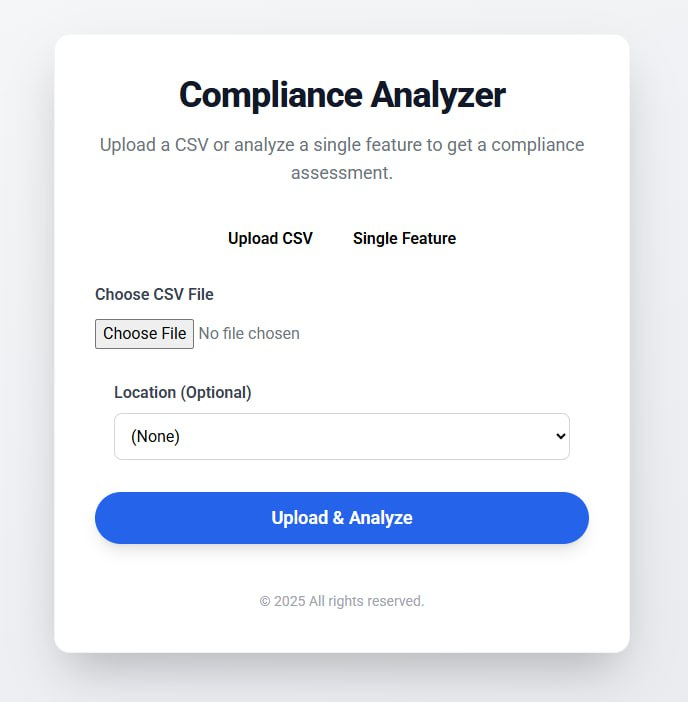
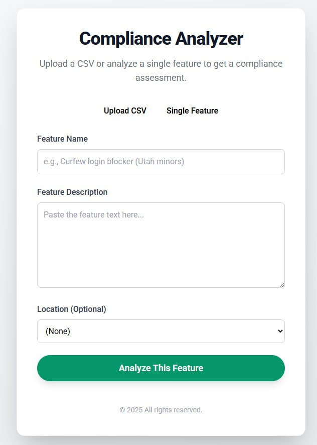
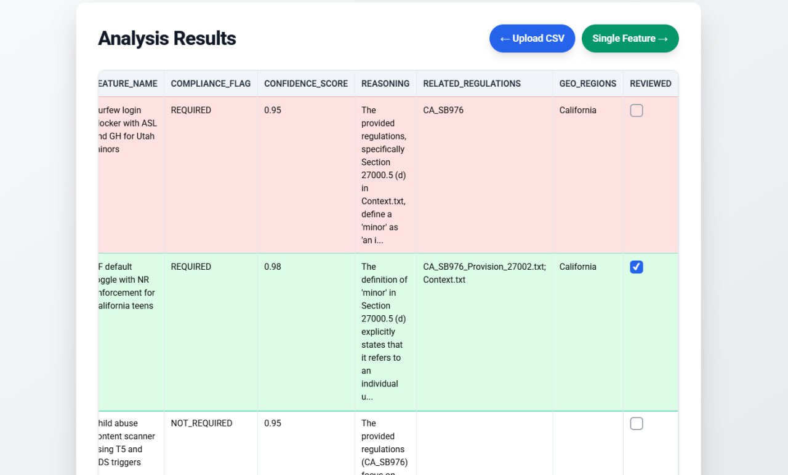

# Geo-Regulator
### An AI-powered Compliance Checker for Software Features
<p>This project is a submission for TikTok's TechJam 2025 Hackathon.</p>

## Problem Statement 
As TikTok (and other global platforms) launch features worldwide, every product must comply with dozens of **regional laws** (e.g., EU DSA, California SB976, Utah Social Media Act). Today, compliance checks are mostly manual, costly, and reactive — companies risk **legal exposure**, **regulatory fines**, **and audit failures** if geo-specific rules are missed.
**Geo-Regulator** solves this by using **AI + RAG (Retrieval-Augmented Generation)** to automatically flag which features require geo-specific compliance logic, with **explanations, confidence scores, and direct references to regulation text.**

## The team 
1. Leader: [Chew Jia Hui, Bryan](https://github.com/bryanjhc)
2. [Chew En Rui, Samuel](https://github.com/Monochromas)
3. [Leonardo Wolf](https://github.com/leowolf275)
4. [Yashvan Alagirisamy](https://github.com/YashvanGH)
5. [Ang Qi Jun](https://github.com/realqijun)

## Core Functionality 
GeoRegulator is a sophisticated Compliance Checker powered by a large language model. It's designed to analyze software feature artifacts—such as titles and descriptions—and automatically determine if they require geo-specific compliance.
The system's key features include:
 - **Dual Input Modes**: 
   - Upload a **CSV of multiple features** (bulk compliance check).
   - Enter a **single feature description** (quick analysis).
 - **Geo-specific Analysis**:
   - For every analysis, the system provides not only a compliance flag but also clear reasoning and, most importantly, the exact source file from which the regulation was derived. This creates a clear, auditable trail.
   - Analyzes feature text against those regulations using LLM reasoning.
 - **RAG-powered Compliance Detection**: 
   - Retrieves relevant **regulation snippets** from uploaded laws.
   - LLM generates compliance flag, reasoning, and linked source file.
 - **Transparent Results**: 
   - Compliance flag: `REQUIRED`, `NOT_REQUIRED`, `UNCERTAIN`.
   - Confidence score (0.0–1.0).
   - Reasoning (editable by user).
   - Related regulations & geographic scope.
 - **Human-in-the-Loop**:
   - Low-confidence rows highlighted (yellow) for manual review.
   - REQUIRED rows highlighted (red) to stress urgency.
   - Reviewer can **edit reasoning** and mark as “Reviewed” with a checkbox.
 - **Audit-ready Output**:
   - Results table with traceability to regulation files.
   - Export as CSV for legal teams and auditors.

## Development Tools Used
 - **Frontend/UI**: TailwindCSS, HTML templates (index.html, output.html)
 - **Backend Framework**: Python
 - **Version Control & Deployment**: Git, Docker (docker-compose for easy setup)

## APIs Used
 - **OpenAI API** (GPT-4 / GPT-3.5 models)
 - **Google Gemini API** (gemini-2.5-flash) for alternative inference

## Assets Used
 - **Regulation Text Files** (stored in `regulations/` folder):
   - EU Digital Services Act
   - California SB976 (Teens Online Protections)
   - Utah Social Media Regulation Act
   - Florida Online Protections for Minors
   - US CSAM Reporting (NCMEC)
 - **Sample CSVs** with feature descriptions (provided + custom test data)

## Libraries Used
 - **Python**:
   - `pandas` → CSV handling + DataFrames 
   - `dotenv` → API key management 
   - `openai`, google-generativeai → LLM access 
   - `flask` → web backend 
   - `matplotlib` → architecture diagram for slides 
   - `chromadb` → Retrieval-Augmented Generation 
   - `concurrent.futures` → Threading
 - **Frontend**:
   - TailwindCSS → responsive styling
   - Vanilla JavaScript → editing, highlighting, CSV export

## Additional Datasets
 - **Terminology Mapping Table** (`terminology_table.csv`)
   - Maps TikTok’s internal jargon (e.g., PF, ASL, GH) into human-readable terms.
   - Used to ensure the AI interprets features correctly.

## Showcase

### 🔄 Batch Processing & Analysis
**CSV Upload Pipeline**
- Upload feature datasets in CSV format with standardized columns (`feature_name`, `feature_description`)
- Asynchronous processing engine handles large datasets efficiently
- Automated terminology translation converts internal jargon (ASL, GH, Jellybean) to clear regulatory language
- Configurable regulation selection allows targeting specific geographic requirements
- Progress tracking with real-time status updates during batch processing



### ⚡ Real-time Single Feature Analysis
**Interactive Compliance Checker**
- Browser-based interface for immediate feature evaluation
- Live terminology lookup and translation preview
- Instant compliance flagging with confidence scoring
- Dynamic regulation matching against EU DSA, California SB976, Utah Social Media Act, Florida Minor Protections, and US NCMEC requirements
- One-click compliance assessment for rapid development workflows



### 📊 Comprehensive Results Dashboard
**Audit-Ready Compliance Reports**
- Detailed compliance matrices with regulatory source citations
- Direct regulation text quotations with exact file path references
- Interactive developer checklists for compliance review workflows
- Confidence scoring and uncertainty flagging for edge cases
- Exportable compliance certificates for regulatory submissions
- Visual compliance status indicators (Required/Not Required/Uncertain)
- Geographic region mapping for multi-jurisdictional features



### 🧠 Advanced AI Pipeline
**Domain-Aware LLM Processing**
- Custom prompt engineering optimized for regulatory analysis
- Domain-specific knowledge base integration with TikTok internal terminology
- Multi-step reasoning chains for complex compliance scenarios
- Confidence calibration algorithms to flag uncertain cases for human review
- Regulation-to-feature matching using semantic similarity and keyword analysis
- Error handling and fallback mechanisms for robust production deployment
```python
def translate_description(self, description: str) -> str:
    """Replace internal jargon with clear descriptions."""
    translated = description
    for term, definition in self.terminology.items():
        pattern = r'\b' + re.escape(term) + r'\b'
        translated = re.sub(
            pattern, f"{term} ({definition})", translated, flags=re.IGNORECASE)
    return translated
```

## Getting Started 

### Prerequisites
 - Python 3.11 or above
 - An API Key from either [Google AI Studio](https://aistudio.google.com/) or [OpenAI](https://platform.openai.com/docs/api-reference/project-api-keys).

### Installation

1. Clone the project onto your machine: <br> `git clone https://github.com/bryanjhc/georegulator.git`
2. Navigate to the project directory: <br> `cd georegulator`
3. Create and activate a Python virtual environment.
4. Install the required libraries: <br> `pip install -r requirements.txt`
5. Create a `.env` file in the root directory and add your API key: <br> `GOOGLE_API_KEY="your_api_key_here"` <br> or <br> `OPENAI_API_KEY="your_api_key_here"`

### How to Run
1. Insert your feature list (in CSV format with `feature_name` and `feature_description` columns) into the `data/` folder.
2. Run the application: <br> `python main.py`
The results will be generated in a CSV file in the `uploads/` folder with a timestamped filename (e.g., `compliance_results_yyyymmdd_hhmmss.csv`).

---

## References 
1. EU Digital Service Act. [DSA](https://en.wikipedia.org/wiki/Digital_Services_Act)
2. California state law - [Protecting Our Kids from Social Media Addiction Act](https://leginfo.legislature.ca.gov/faces/billTextClient.xhtml?bill_id=202320240SB976)
3. Florida state law - [Online Protections for Minors](https://www.flsenate.gov/Session/Bill/2024/3)
4. Utah state law - [Utah Social Media Regulation Act](https://en.wikipedia.org/wiki/Utah_Social_Media_Regulation_Act)
5. US law on reporting child sexual abuse content to NCMEC -  [Reporting requirements of providers](https://www.law.cornell.edu/uscode/text/18/2258A)